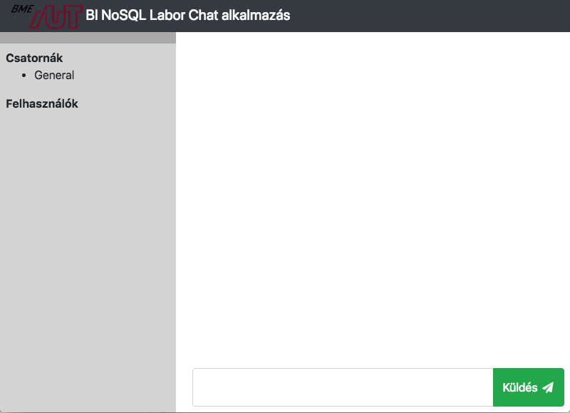
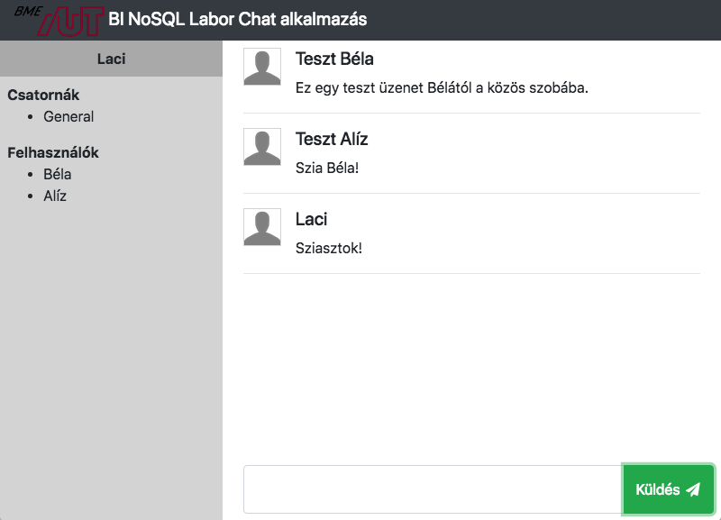
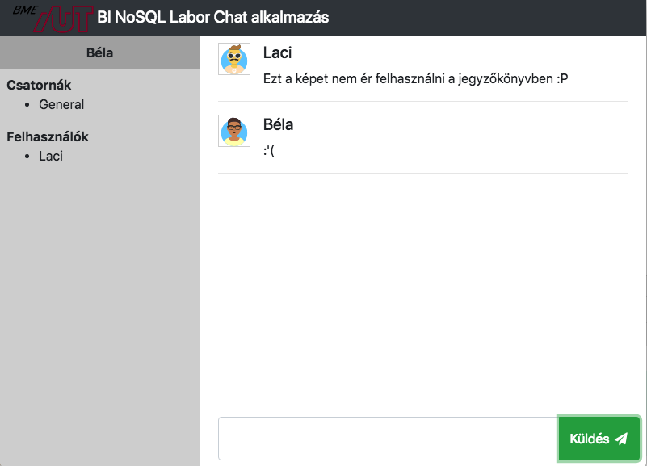
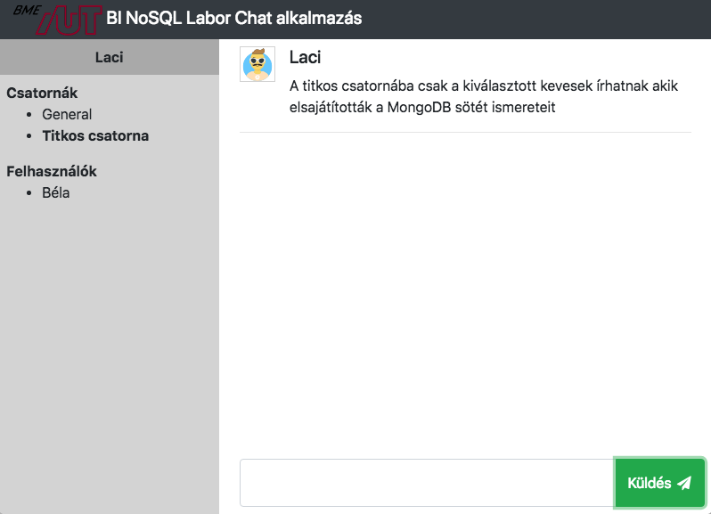
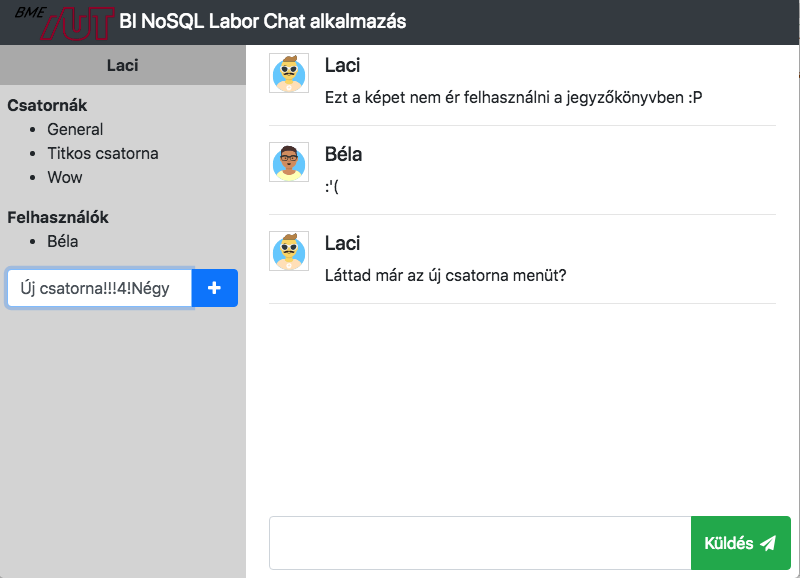

# NoSQL BI-Labor
Ez az anyag a `BMEVIAUMB00` Üzleti Intelligencia laboratórium tárgy, NoSQL tematikájú méréséhez készült. A labor három
részből áll:

1. Egy rövid ismertetőből a felhasznált technológiákról.
2. Egy demonstrációs célú alkalmazás közös implementációjából.
3. Egyedi feladatok megoldásából.

A labor során a különböző NoSQL megoldásokat demonstrálandó, egy egyszerű Chat alkalmazást fogunk elkészíteni.

## 1. Technológiai bevezető
Az elkészülő alkalmazásunk több NoSQL technológiára épít, valamint előkerülnek bizonyos részek az Üzleti Intelligencia
tárgy tematikájából, mint például az Electron.

A NoSQL adatbázisok (**N**ot **O**nly **SQL**) elsősorban nem a tradicionális RDBMS-ek lecserélésére születtek, hanem
az olyan területek lefedésére, ahol azok felhasználása nem optimális (például teljesítmény, vagy komplexitási 
problémák miatt). Éppen ezért a NoSQL adatbázisok is erősen eltérőek lehetnek egymástól, az alábbi fő típusokat
különböztetjük meg.

- Kulcs - Érték alapú tárolók
    * Pl.: REDIS, Apache Accumulo
- Dokumentum alapú
    * Pl.: MongoDB, CouchDB
- Oszlop alapú
    * Pl.: Cassandra, HBase
- Gráf DB
    * Pl.: Neo4j, InfiniteGraph
- Objektum alapú
    * Pl.: OrientDB

### 1.1. MongoDB
A MongoDB dokumentum alapú tárolást tesz lehetővé, ami talán az összes közül leginkább hasonlít a relációs
adatbázisoknál megszokott modellhez. A MongoDB az alábbi alapfogalmakkal dolgozik:

#### Document
Az adattárolás alapja, egy JSON struktúrában leírható entitás. A relációs adatmodellben egy rekord-nak lehet leginkább
megfeleltetni. A relációs modellel szemben egy dokumentumra nem vonatkoznak séma megkötések, azaz tetszőleges számú
és tartalmú mezővel rendelkezhet.

```
{
   field1: value1,
   field2: value2,
   field3: value3,
   ...
   fieldN: valueN
}
```

Minden dokumentumnak van egy egyedi azosítója amit az `_id` mező tárol, ez alap esetben egy `ObjectID` típusú mező,
amit az adatbázis generál. Mivel ez tartalmazza a timestampet is, könnyen használható dokumentumok keletkezési sorrend
szerinti rendezésére.

#### Collection
Több dokumentum közös tárolója a Collection, egy dokumentum mindig pontosan egy collection-ben található. Ugyanakkor
nincsenek megkötések arra vonatkozóan, hogy egy collection-be hány és milyen dokumentum legyen.


```
{
   firstName: "Béla",
   lastName: "Kovács",
   email: "kovacs@bela.hu",
   favouriteAnimal: "cat"
},
{
   firstName: "Alíz",
   email: "alíz@email.com",
   eyeColor: "Blue"
},
{
   firstName: "Sándor",
   lastName: "Tóth",
   eyeColor: "Blue"
}

```

A Collection-öket lehet query-zni, ekkor a query feltételeket kielégítő dokumentumokat kapjuk vissza, például a fentebbi 
collectionön:

```
// Query
db.getCollection('myCollection').find({firstName: "Béla"})

// Eredmény
{
   firstName: "Béla",
   lastName: "Kovács",
   email: "kovacs@bela.hu",
   favouriteAnimal: "cat"
}
```
```
// Query
db.getCollection('myCollection').find({eyeColor: "Blue"})

// Eredmény
{
   firstName: "Alíz",
   email: "alíz@email.com",
   eyeColor: "Blue"
},
{
   firstName: "Sándor",
   lastName: "Tóth",
   eyeColor: "Blue"
}
```

### 1.2. Redis
A REDIS egy rendkívül gyors, egyszerű kulcs-érték pár tároló, amely nagyrészt a memóriában dolgozva nagyon alacsony
válaszidőt nyújt. Ugyanakkor a perzisztencia is biztosított megkötésekkel, létezik snapshot szerű 
állapot mentés, illetve folyamatos írási napló alapú perzisztencia is.

#### Típusok
A REDIS több adat típust is támogat, ezek az adott kulcs-hoz tartozó érték "mezőben" jelennek meg, például:

* String
* List
* Set
* Hash
* Bitmap

#### Példa parnacsok
A https://try.redis.io oldalon kipróbálhatjuk a REDIS parancssori interfészét, ami a legtöbb nyelv specifikus library
alapjául is szolgált.
Próbáljuk ki a következő alap REDIS parancsokat néhány példa adaton.

REDIS-ben több adatbázisunk is lehet, melyek egy számmal vannak reprezentálva, az alapértelmezett a 0-s adatbázis.

Válasszuk ki az alapértelmezett adatbázist (nem kötelező):

```
SELECT 0
```
Illesszünk be egy értéket:

```
SET department AUT
```
Kérdezzük le a beillesztett értéket:

```
GET department
```
REDIS-ben az adatok elsőként a memóriába kerülnek tárolásra, de a REDIS gondoskodik a perzisztálásról/lemezre mentésről is (alapesetben másodpercenként), így a gyors és hosszú távú adattárolás is megoldott.

Lehetőség van azonban megadott ideig tárolni csak egy adatot. A következő paranccsal létrehozunk egy értéket, és beállítjuk, hogy csak 10 másodpercig legyen érvényes. A TTL parancs a hátralevő érvényességi idő kiírására szolgál:

```
SET department AUT
EXPIRE department 10
TTL department
```
Amennyiben mégis szeretnénk perzisztálni, akkor a PERSIST parancsot kell
használni:
```
PERSIST department
```
Ebben az esetben a TTL már -1 értéket ad vissza.

```
SUBSCRIBE mychannel
PSUBSCRIBE my\*
PUBLISH mychannel “test message”
```

**Példa lista műveletekre**

```shell
LPUSH mylist a # (integer) 1
LPUSH mylist b # (integer) 2
LPUSH mylist c # (integer) 3
LRANGE mylist 0 -1 # ”a”, “b”, “c”
LLEN mylist # (integer) 3
DEL mylist # (integer) 1
```

### 1.3. Electron
Az Electron egy Chromium alapú keretrendszer, ami cross platform alkalmazások fejlesztését teszi lehetőve. A felület
a szokásos web-es technológiákkal elkészíthető, majd becsomagolva a futtató környezetbe prezentálható mint vastagkliens
alkalmazás. 


## 2. Az alkalmazás
Az alkalmazás amit ezen a laboron elkészítünk egy egyszerű chat program. A felhasználók bejelentkezhetnek, egymással 
chatelhetnek a fő szobában, valamint privát üzeneteket küldhetnek egymásnak. Az alkalmazás kiinduló sablonját ez
a repository adja.

### 2.1. Megjelenítés
Az első lépés az alkalamzás megjelenítésének elkészítése, ez a komplikációk elkerülése végett egyszerű HTML-ben
történik, vanilla JavaScript-tel (azaz nem használunk külön keretrendszert). Kezdjük magának a chat felületnek az
elkészítésével.

**1. Feladat:** Hozzuk létre a projekt gyökér mappájában a `chat.html` fájlt az alábbi tartalommal:

```
<!DOCTYPE html>
<html class="fill-vertical" lang="hu">
<head>
    <meta charset="UTF-8">
    <title>Chat alkalmazás</title>

    <!-- Importáljuk a Bootstrapet-->
    <link rel="stylesheet" href="node_modules/bootstrap/dist/css/bootstrap.min.css">
    <link rel="stylesheet" href="node_modules/font-awesome/css/font-awesome.min.css">
    <link rel="stylesheet" href="chat.css">

</head>
<body class="fill-vertical">
<!-- Chat képernyő -->
<div id="main-window" class="container-fluid p-0 app-window">
    <!-- Navbar -->
    <nav class="navbar navbar-expand navbar-dark bg-dark chat-nav">
        <a class="navbar-brand" href="#">
            
            <span class="align-middle">BI NoSQL Labor Chat alkalmazás</span>
        </a>
    </nav>

    <!-- Chat terület -->
    <div class="row chat-body">
        <!-- Felhasználók oszlop -->
        <div class="col-md-4">
            <div class="selector-panel">
                <div class="selector-panel-header">
                    <span id="username"></span>
                </div>
                <div class="selector-panel-body">

                    <b>Csatornák</b>
                    <ul id="channel-list">
                        <li class="selector-panel-item" onclick="chatController.changeRoom('default')">General</li>
                    </ul>

                    <b>Felhasználók</b>
                    <ul id="user-list">
                        <!-- Ide jönnek a felhasználók -->
                    </ul>
                </div>
            </div>
        </div>
        <!-- Középső sáv (üzenetek + üzenet írás) -->
        <div class="col-md-8 messages-panel">

            <!-- Eddigi üzenetek a szobában -->
            <div id="messages-panel" class="row messages-panel-history">
                <div id="messages" class="messages">
                    <!-- Ide jönnek majd az üzenetek -->
                </div>
            </div>

            <!-- Új üzenet írása -->
            <div class="row messages-panel-new">
                <div class="input-group">
                    <textarea id="new-message-text" class="form-control" aria-label="With textarea"></textarea>
                    <div class="input-group-append">
                        <button class="btn btn-success" onclick="chatController.sendMessage()">Küldés <i
                                class="fa fa-fw fa-send"></i></button>
                    </div>
                </div>
            </div>
        </div>
    </div>
</div>
<script>
  const chatController = require('./chat-controller.js');
  const chatService = require('./chat-service.js');

  window.onbeforeunload = function () {
    chatService.disconnect();
  }
</script>
</body>
</html>
```
Illetve szintén a gyökér mappában a `chat.css`-t az alábbi tartalommal:

```
/* A Bootstrap containerrül elvesszük a paddingot (jobban néz ki így desktopon) */
.container-fluid{
    overflow: hidden;
    padding-right: 0;
    padding-left: 0;
}

/* Segédosztály a maximális függőleges kitöltéshez */
.fill-vertical {
    height: 100%;
}

.login-window {
    height: 100%;
}

/* A teljes chat alkalmazásunk ablaka */
.app-window {
    display: flex;
    flex-direction: column;
    height: 100%;
}

.chat-nav {
    flex-shrink: 0;
    height: 45px;
}

/* A felhasználók, üzenetek és új üzenet írása rész (minden a header alatt) */
.chat-body {
    flex-grow: 1;
}

.selector-panel {
    background-color: darkgray;
    height: 100%;
}

.selector-panel-header {
    text-align: center;
    font-weight: bold;
    padding-top: 8px;
    padding-bottom: 8px;
}

.selector-panel-body {
    background-color: lightgray;
    height: 100%;
    padding: 8px;
    overflow-y: auto;
}

.selector-panel-item:hover {
    text-decoration: underline;
    cursor: pointer;
}

.messages-panel {
    display: flex;
    flex-direction: column;
    padding-left: 0;
    padding-top: 8px;
}

.messages-panel-history {
    flex-grow: 3;
    height: 100%;
    padding-left: 23px;
    padding-right: 23px;
    overflow-y: scroll;
}

.messages {
    width: 100%;
}

.message-avatar {
    border-width: 1px;
    border-style: solid;
    border-color: lightgray;
}

.messages-panel-new {
    flex-grow: 1;
    margin: 8px;
}

.messages-new-input {
    width: 100px;
}

textarea {
    resize: none;
}
```

Az `npm start` parancs kiadása után az alábbi ablak jelenik meg ha mindent jól csináltunk.


**2. Feladat:** Építsük tovább az alkalmazásunkat a felületi és üzleti logika megvalósításával! Ehhez előszőr is 
kiegészítjük a felületünket egy új lépéssel, a bejelentkező képernyővel. Ehhez adjuk hozzá az alábbi kódrészletet 
a `chat.html` `<body>` tagje alá közvetlen:

```
<!-- Bejelentkező képernyő -->
<div id="login-window" class="container login-window">
    <div class="jumbotron">
        <h1>BI Labor NoSQL Chat</h1>
        <p>Üdv a BI Labor keretében elkészítendő chat alkalmazásban, ami a különböző NoSQL adatbázisok működését
            demonstrálja, egy kis ízelítővel Electron-ból.</p>
    </div>
    <div class="input-group mb-3">
        <div class="input-group-prepend">
            <span class="input-group-text"><i class="fa fa-fw fa-user"></i></span>
        </div>
        <input id="usernameInput" type="text" class="form-control" placeholder="Felhasználónév">
    </div>
    <div class="input-group mb-3">
        <div class="input-group-prepend">
            <span class="input-group-text"><i class="fa fa-fw fa-server"></i></span>
        </div>
        <input id="serverInput" type="text" class="form-control" placeholder="Szerver IP">
    </div>
    <div class="input-group mb-3">
        <div class="input-group-prepend">
            <span class="input-group-text"><i class="fa fa-fw fa-password"></i></span>
        </div>
        <input id="passwordInput" type="text" class="form-control" placeholder="Szerver Jelszó">
    </div>
    <div class="text-center">
        <button class="btn btn-primary" onclick="chatController.login()"><i class="fa fa-fw fa-sign-in"></i>Bejelentkezés
        </button>
    </div>
</div>
```

Rejtsük el a chat képernyőt egy `style="display:none"` attribútummal, azaz a `main-window` ID-val rendelkező div-re
vegyük fel ezt, valahogy így:

```
...
<!-- Chat képernyő -->
<div id="main-window" class="container-fluid p-0 app-window" style="display:none">
...
```
Mostmár létrehozhatjuk a felületi logikát leíró `chat-controller.js` fájlt az alábbi tartalommal:
```
const chatService = require('./chat-service.js');
const _ = require('lodash');

const chatController = {};

// Inicializáljuk a beállításokat
let selectedRoom = 'default';
let myUsername = '';

// Bejelentkezéskor meghívódik és inicializálja a default szobát
chatController.login = function () {
  let usernameInput = document.getElementById('usernameInput');
  let serverInput = document.getElementById('serverInput');
  let passwordInput = document.getElementById('passwordInput');


  if (_.isEmpty(usernameInput.value) || _.isEmpty(serverInput.value)) {
    alert('Kérlek add meg az összes adatot!');
  } else {
    myUsername = _.escape(usernameInput.value);
    chatService.connect(usernameInput.value, serverInput.value, passwordInput.value, function () {
        //Sikeres csatlakozás esetén
        // Screen-t váltunk (szegényember SPA-ja)
        document.getElementById('login-window').style.display = 'none';
        document.getElementById('main-window').style.display = 'flex';

        // Kiírjuk a bejelentkezett felhasználó nevét
        document.getElementById('username').innerText = myUsername;
        chatController.refreshUsers();
        chatController.refreshRoom();
      },
      function (err) {
        alert("Nem sikerült csatlakozni az adatbázishoz: " + err)
      },
      // Új üzenet érkezett valahova (esemény a room_channel-ben)
      function (roomName) {
        if (roomName === selectedRoom) {
          chatController.refreshRoom();
        }
      },
      // Változott a felhasználók száma
      function () {
        chatController.refreshUsers();
      });
  }
};

// Megjelenít egy új üzenetet az üzenő területen
chatController.renderNewMessage = function (message) {
  // Megkeressük a DOM-ban a "messages" ID-val rendelkező üzenő területet, ami egy rendezetlen lista (<ul>).
  let messageArea = document.getElementById('messages');

  // Kitöltünk és hozzáadunk egy új üzenetet a HTML sablon alapján
  messageArea.insertAdjacentHTML('beforeEnd',
    '<div class="media messages">' +
    '' +
    '<div class="media-body">' +
    '<h5 class="mt-0">' + _.escape(message.user) + '</h5>' + _.escape(message.content) +
    '</div>' +
    '</div>' +
    '<hr>'
  );

  // Lescrollozunk az üzenetek aljára
  document.getElementById('messages-panel').scrollTo(0, messageArea.scrollHeight);
};

// Megjelenít egy felhasználót a felhasználói területen
chatController.renderNewUser = function (user) {
  let userList = document.getElementById('user-list');
  let listedUser = _.escape(user);

  // Elnevezzük a két user közötti privát chatet jelző szobát, a sorrend fontos hogy kétirányú lehessen a kommunikáció
  let keys = _.orderBy([myUsername, listedUser]);
  let privateRoomName = keys[0] + '_' + keys[1];

  if (selectedRoom === privateRoomName) {
    // Ha már itt vagyunk nem kell linket készíteni.
    userList.insertAdjacentHTML('beforeEnd', '<li class="selector-panel-item selected"><b>' + listedUser + '</b></li>');
  } else {
    userList.insertAdjacentHTML('beforeEnd', '<li class="selector-panel-item" onclick="chatController.changeRoom(\'' + privateRoomName + '\')">' + listedUser + '</li>');
  }
};

// Új üzenetet küldünk a felhasználónkkal
chatController.sendMessage = function () {
  let textInput = document.getElementById('new-message-text');
  if (!_.isEmpty(textInput.value)) {
    let message = {
      user: myUsername,
      content: textInput.value,
      date: new Date()
    };
    chatController.renderNewMessage(message);
    chatService.sendMessage(selectedRoom, message);
  }
  textInput.value = '';
};

// Ha megváltoztatjuk a szobát
chatController.changeRoom = function (roomName) {
  selectedRoom = roomName;
  chatController.refreshRoom();
  chatController.refreshUsers();
};

// Frissítjük a szoba üzeneteinek tartalmát
chatController.refreshRoom = function () {
  document.getElementById('messages').innerHTML = '';
  // Betöltjük az üzeneteket
  chatService.getMessages(selectedRoom, function (messages) {
    _.forEach(messages, function (message) {
      chatController.renderNewMessage(message);
    })
  });
};

// Frissítjük a felhasználói lista tartalmát
chatController.refreshUsers = function () {
  document.getElementById('user-list').innerHTML = '';
  // Betöltjük a felhasználókat (magunkat nem írjuk ki)
  chatService.getUsers(function (users) {
    _.forEach(users, function (user) {
      if (myUsername !== user) {
        chatController.renderNewUser(user);
      }
    });
  });
};

module.exports = chatController;
```
Miután tüzetesen megvizsgáltuk a kódot, megismertük az egyes függvények funkcióit, láthatjuk hogy maga a chat logika nem
ebben a fájlban került implementálásra. Az üzenetek és bejelentkezett felhasználók forrása a `chat-service.js`, így
hozzuk létre azt is, egyelőre az alábbi, mock tartalommal:

```
let _ = require('lodash');

const chatService = {};

// A felhasználónk neve
let myUsername;
let messages = {
  default: [
    {
      user: "Teszt Béla",
      date: new Date(),
      content: "Ez egy teszt üzenet Bélától a közös szobába."
    },
    {
      user: "Teszt Alíz",
      date: new Date(),
      content: "Szia Béla!"
    },
  ]
};

// Csatlakozáskor hívott függvény
chatService.connect = function (username, serverAddress, password, successCb, failCb, messageCallback, userCallback) {
  myUsername = username;
  successCb();
};

// Lecsatlakozik a szerverről
chatService.disconnect = function () {

};

// Visszaadja a szobában található üzeneteket
chatService.getMessages = function (roomId, cb) {
  cb(messages[roomId]);
};

// Visszaadja a bejelentkezett usereket
chatService.getUsers = function (cb) {
  cb([
    "Béla",
    "Alíz"
  ])
};

// Üzenetet küld
chatService.sendMessage = function (roomId, message) {
  (messages[roomId] = messages[roomId] || []).push({
    user: myUsername,
    date: message.date,
    content: message.content
  });

};

module.exports = chatService;

```

Ha jól csináltunk, elindítva az alkalmazásunkat már működik a chat, az egyes felhasználók nevére kattintva tudunk nekik
üzenni.



### 2.2. Adatbázis
Most, hogy van egy működő alkalmazás vázunk kezdődik a labor érdemi, NoSQL-el foglalkozó része! Első feladatként 
perzisztáljuk az üzeneteket MongoDB-ben. Erre az alábbi adatmodellt találtuk ki:

```
Message:
{
    user: <String - A felhasználó neve>
    date: <Date - Mikor küldte az üzenetet>
    content: <String - Az üzenet tartalma>
    room: <String - A szoba neve ahova az üzenet ment>
}
```

Azaz egy üzenetet egy ilyen tulajdonságokkal bíró `document` fog tárolni, ezek a messages `collection`-ben lesznek. Az
egyszerűbb adatbázis kommunikáció érdekében a mongoose nevű library-t fogjuk használni. Módosítsuk a chat-service.js 
fájlunkat az alábbiak szerint:

* Töröljök a `let messages = { ... }` deklarációt (hisz ez eddig csak mockolt).
* Importáljuk a mongoose-t az alábbi parancs fájl elején történő elhelyezésével: `let mongoose = require('mongoose');`
* Módosítsuk a `chatService.connect` függvényt az alábbira, hogy ténylegesen csatlakozzunk is az adatbázishoz:
```
// Csatlakozáskor hívott függvény
chatService.connect = function (username, serverAddress, password, successCb, failCb, messageCallback, userCallback) {
  myUsername = username;
  mongoose.connect('mongodb://bilabor:' + password + '@' + serverAddress + ':27017/bilabor?authSource=admin', {useNewUrlParser: true, useUnifiedTopology: true}).then(function () {
    successCb();
  }, failCb);
};
```
* Definiáljuk az üzenet modelljét a mongoose számára, az alábbi deklaráció felvételével a `chatService.connect` fölötti
sorba:
```
// Az üzenet model leírása
const Message = mongoose.model('Message', new mongoose.Schema({
  user: String,
  date: Date,
  content: String,
  room: String
}));
```
* Szintén írjuk át a `chatService.getMessages` függvényt, hogy az adatbázist hívja:
```
// Visszaadja a szobában található üzeneteket
chatService.getMessages = function (roomId, cb) {
  Message.find({room: roomId}, function (err, msg) {
    cb(msg)
  });
};
```
* Írjuk át a `chatService.sendMessage` függvényt, hogy beleírja az adatbázisba az üzenetet.
```
// Üzenetet küld
chatService.sendMessage = function (roomId, message) {
  let msg = new Message({
    user: myUsername,
    date: message.date,
    content: message.content,
    room: roomId
  });
  msg.save();
};
```
Ezzel készen is vagyunk, az üzeneteink immáron a közös MongoDB adatbázisban tárolódnak, tudunk egymásnak üzenni, de az
üzenetek még nem jelennek meg maguktól, csak kézi frissítésre.

**Adatbázis elérést kérj a labor vezetőtől, mert ez mérésenként változik!**

### 2.3. Valós idejű kommunikáció
Az éppen aktuálisan online felhasználók listáját nem célszerű általában adatbázisban tárolni, hisz gyakran változhat,
folyamatosan frissíteni kellhet, ráadásul nem is üzleti adat. A mi alkalmazásunkban éppen ezért ezt egy REDIS
kulcs-érték tárral fogjuk megoldani. Ennek két feladata lesz:

* Tárolni az éppen aktuális felhasználók listáját.
* Értesíteni a feliratkozókat ha ez változik.

A második feladatot a REDIS Publish-Subscribe modell segítségével fogjuk megvalósítani, amely lehetővé teszi `channel`-ek
létrehozását, amelyekbe események küldhetők be, valamint kliensek iratkozhatnak fel a figyelésükre.

Tehát összegezve:
* Lesz egy `SortedSet`-ünk amiben a felhasználók lesznek, "önbevallásos" alapon.
* Lesz egy `users_channel` ahova akkor küldünk üzenetet, ha egy felhasználó belép vagy kijelentkezik (az üzenet tartalma
lényegtelen).
* Lesz egy `rooms_channel` ahova akkor küldünk üzenetet, ha egy szobába új üzenet érkezik egy szobába, az üzenet
tartalma a szoba neve.

Kezdjük az implementációt a redis kliens importálásával és az egyes csatornák neveinek rögzítésével, tegyük az alábbit 
a `chat-service.js` fájl elejére (a mongoose import alá például):
```
let redis = require('redis');

const roomsChannel = 'rooms_channel';
const usersChannel = 'users_channel';
let redisClient;
let redisSubscriberClient;
```
Ezek után a `chatService.connect` függvényt kell frissítenünk, írjuk át az alábbira:

```
// Csatlakozáskor hívott függvény
chatService.connect = function (username, serverAddress, password, successCb, failCb, messageCallback, userCallback) {
  myUsername = username;
  let dbReady = false;
  let mqReady = false;

  let db = mongoose.connect('mongodb://bilabor:' + password + '@' + serverAddress + ':27017/bilabor?authSource=admin', {useNewUrlParser: true, useUnifiedTopology: true});
  redisClient = redis.createClient({
    host: serverAddress, password: password, retry_strategy: function () {
    }
  });

  // Ha minden kapcsolat felépült
  function connectionSuccesfull() {
    // Felvesszük magunkat az online user listára
    redisClient.zadd(usersChannel, 0, username);
    // Szólunk a channelen hogy bejelentkeztünk
    redisClient.publish(usersChannel, username);

    // Feliratkozunk az eseményekre amiket figyelnünk kell
    // A subscribehoz külön kliens kell, ezért lemásoljuk az eredetit
    redisSubscriberClient = redisClient.duplicate();
    redisSubscriberClient.subscribe(roomsChannel);
    redisSubscriberClient.subscribe(usersChannel);
    redisSubscriberClient.on('message', function (channel, message) {
      if (channel === roomsChannel) {
        // Ha a szoba channel-be érkezik üzenet azt jelenti valamelyik szobába frissíteni kell az üzeneteket
        messageCallback(message);
      } else if (channel === usersChannel) {
        // Ha a user channelbe érkezik üzenet azt jelenti változott a user lista
        userCallback();
      }
    });

    successCb();
  }

  // Nem tudjuk a kettő CB közül melyik hívódik meg előszőr, így a második után fogunk csak visszahívni
  db.then(function () {
    dbReady = true;
    if (mqReady === true) {
      connectionSuccesfull();
    }
  }, failCb);

  // Redis kliens eseményei
  redisClient.on('ready', function () {
    mqReady = true;
    if (dbReady === true) {
      // Ha a DB kapcsolatot is felépítettük bejelentkezünk
      connectionSuccesfull();
    }
  });
  redisClient.on('error', failCb);
};
```
Ez kicsit komplexebb kódrészlet, a lényege, hogy az adatbázis és redis kapcsolatok felépítése után feliratkozunk a
megadott csatornákra. Az ott berékező események hatására hívjuk meg a `chat-controller` megfelelő callback metódusait,
amit frissítik felületet.

Szintén implementáljuk a `chatService.disconnect` függvényt is (azaz szóljunk a REDIS-nek ha bezártuk az app-ot).
```
// Lecsatlakozik a szerverről
chatService.disconnect = function () {
  if (!_.isUndefined(redisClient)) {
    redisClient.zrem(usersChannel, myUsername);
    redisClient.publish(usersChannel, myUsername);
  }
};
```
Írjuk felül a `chatService.getUsers`-t is, hogy a REDIS-ből szedje az adatokat, ehhez a ZRANGE függvényt fogjuk
használni.
```
// Visszaadja a bejelentkezett usereket
chatService.getUsers = function (cb) {
  redisClient.zrange(usersChannel, 0, -1, function (error, result) {
    cb(result);
  });
};
```
Végül egészítsük ki a `chatService.sendMessage` függvényt, hogy sikeres adatbázis mentés esetén szóljon a változásról:
```
// Üzenetet küld
chatService.sendMessage = function (roomId, message) {
  let msg = new Message({
    user: myUsername,
    date: message.date,
    content: message.content,
    room: roomId
  });
  msg.save().then(function () {
    // Szólunk hogy frissítettük a szobában az üzeneteket
    redisClient.publish(roomsChannel, roomId)
  })
};
```
Ezzel végeztünk is a közös feladatokkal! A labor további részén önálló munka folyik.

## 3. Egyéni feladatok
Az eddigi rész az elégséges határa, a 3 egyéni feladat megoldása mindegyik +1 jegyet jelent, azaz:
* Vezetett rész + 1 megoldott egyéni = 3
* Vezetett rész + 2 megoldott egyéni = 4
* Vezetett rész + összes megoldott egyéni = 5

### 3.1. Avatarok
Legyen lehetősége a felhasználónak saját avatar URL megadására, ezt tárolja az adatbázis a `Messages` collectionben,
az egyes dokumentomokban az `avatarUrl` mező alatt. Figyelj a kulcsok pontos betartására, ha mindenki így
implementálja a kliensét, akkor egymás avatar-jai látszódni fognak másoknál is.

**Tipp**: használj valamilyen online avatar generálót, pl.: https://getavataaars.com. Ekkor nem kell a fájl hostolását
megoldani.



### 3.2. Csatornák
A chat program tetszőleges számú csatornát tud kezelni, ám jelenleg csak a `default` létezik, valamint az egyes
privát üzeneteknek jön létre a hattérben szoba. Valósítsd meg, hogy az alkalmazás a csatornák listáját a MongoDB
`channels` collectionjéből vegye induláskor (a collection nevét a Mongoose többesszámmal látja el, azaz a modellt elég 
`channel`-nek hívni). Ebben a collectionben olyan dokumentumok vannak amiknek egy attribútuma van, a `name` ami a szoba 
nevét adja meg. **Nem része ennek a feladatnak a szoba létrehozás, sem a változás figyelése!** A tesztelés
megkönnyítésére már létrehoztunk pár példát az adatbázisban.



### 3.3. Csatorna változás figyelés
Egészítsd ki az előző funkciót azal, hogy az alkalmazás figyeli a REDIS-es `channels_channel`-t, az ide érkező események
hatására frissítve a szoba listát. Teszteléshez felvehetsz tetszőleges szobát akár programozottan (például a 
`connect` függvény kiegészítésével, hogy sikeres csatlakozás után hozzon létre egy új szobát), akár a felületre
kivezetett gombok segítségével (de ez nem kötelező, ez nem HTML/CSS labor).



